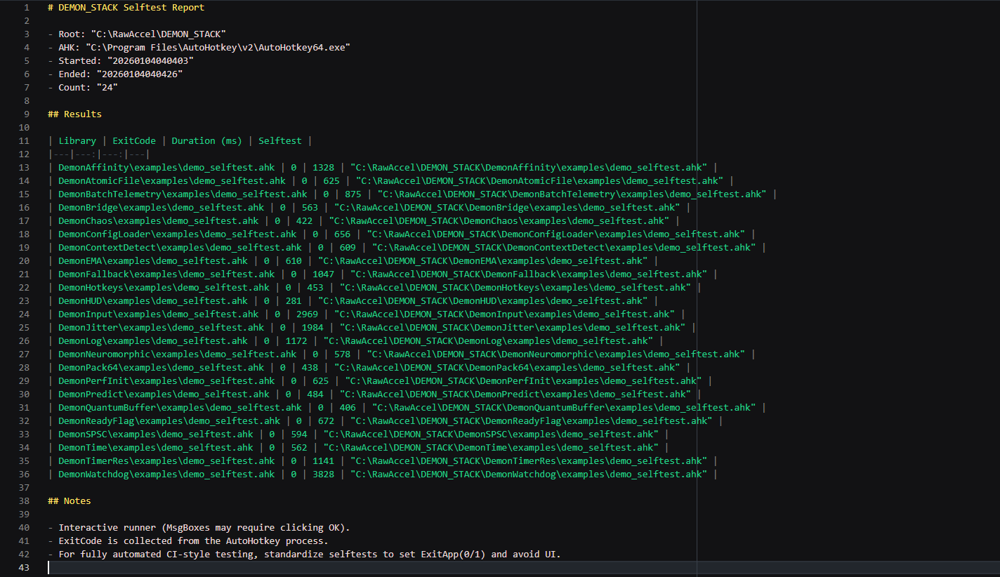

# DEMON_STACK (AutoHotkey v2)

High-performance, testable AHK v2 library suite for **real-time pipelines**.

DEMON_STACK is a collection of standalone AutoHotkey v2 libraries extracted from the DEMON architecture.  
It is designed for situations where **every microsecond and every missed frame matters**:

- lock-free concurrency
- cache-friendly memory layouts
- deterministic selftests
- clear APIs and operational notes
- “Gold stack” reference pipelines that show real integrations

All modules are **pure AutoHotkey v2** – no external DLLs, drivers, or kernel components.

> If you just need simple hotkeys or macros, this is overkill.  
> If you’re pushing AHK into territory usually reserved for C++ (telemetry, real‑time input processing, multi‑process coordination), this is for you.

---

## When is DEMON_STACK useful?

Use it when you need things like:

- **Ultra-fast inter-process communication** at 1000+ Hz without blocking
- **Producer–consumer decoupling** in tight loops (don’t stall input when processing is slow)
- **Stall detection and auto-healing** (detect hangs, widen timers, switch to degraded mode)
- **Precise jitter/latency tracking** with statistics (min/max/percentiles)
- **Domain-agnostic “brain” pipelines**: input → context → decisions → telemetry

You *probably don’t need it* for:

- Simple hotkey remaps
- One-off automation that runs a few times per minute
- Scripts where ±10–50 ms of jitter is fine

---

## Core philosophy

- **Zero external dependencies**  
  Pure AutoHotkey v2. Clone, include, run.

- **Cache-friendly, deterministic design**  
  - Fixed-size payloads where possible  
  - 64-byte cache line awareness and SOA layouts  
  - Explicit memory barriers and ordering where required

- **Tested & composable**  
  Every library comes with:
  - a selftest (`examples/demo_selftest.ahk`)
  - `docs/overview.md` (what it does, why it exists)
  - `docs/api.md` (how to call it)

  

- **Gold stacks (reference pipelines)**  
  Ready-to-run example pipelines that show how to combine multiple libraries:
  - e.g. dual-lane input → SPSC ring → EMA smoothing → lock-free IPC → telemetry

---

## Repo map

- Base libraries: `Demon*/`
- Gold stacks (reference recipes): `stacks/GOLD_*`
- Tools: `tools/`
- Reports (generated locally): `reports/` (usually ignored in Git)

Each library folder typically contains:

- `src/` – implementation
- `examples/demo_selftest.ahk` – self-contained test/demo
- `docs/api.md` and `docs/overview.md`
- `README.md`, `CHANGELOG.md`, `LICENSE`

---

## Requirements

- **AutoHotkey v2** (64‑bit recommended)
- Windows (shared memory + RawInput are Win-specific)

---

## Base libraries (overview)

### IPC and transport

- **DemonBridge** – Lock-free shared memory IPC:
  - Single-writer, lock-free seqlock pattern
  - Optional CRC32 integrity check
  - Cache-aware layout to minimize contention and false sharing
- **DemonPack64** – Fixed 64-byte payload pack/unpack helpers
- **DemonSPSC** – Single-producer, single-consumer ring buffer (dx, dy, t64; power-of-2 slots) – perfect for decoupling input sampling from processing

### Input and smoothing

- **DemonInput** – Dual-lane input sampling (Timer lane + RawInput lane) with runtime switching
- **DemonEMA** – dt-based exponential moving average (no fixed frame rate assumptions)
- **DemonBatchTelemetry** – Batch telemetry writers (CSV / JSONL / both)

### Context and decision logic

- **DemonContextDetect** – Motion/context classifier (Idle/Long/Close + confidence)
- **DemonPredict** – Decision engine driven by context/features (e.g. ADS/HPR style decisions)
- **DemonNeuromorphic** – Lightweight leaky integrate-and-fire “spike” layer
- **DemonChaos** – Lorenz-inspired chaos score + cooldown bias
- **DemonQuantumBuffer** – Probabilistic accumulator with collapse gate

### Timing, reliability, and system controls

- **DemonTime** – QPC timing helpers
- **DemonWatchdog** – Stall detection + degraded-mode signaling
- **DemonFallback** – Policy wrapper for watchdog-driven fallbacks
- **DemonJitter** – Latency/jitter tracker + percentile stats
- **DemonTimerRes** – Timer resolution request (system-wide, best-effort)
- **DemonPerfInit** – Opt-in performance presets + best-effort restore token
- **DemonAffinity** – CPU affinity helpers (process/thread pinning)

### Utilities

- **DemonConfigLoader** – INI-first config loader + typed getters + poll-based hot reload
- **DemonAtomicFile** – Atomic-ish file writing (temp in same dir → replace)
- **DemonReadyFlag** – Shared memory “ready” flag to coordinate multiple processes

### UI and controls

- **DemonHUD** – Small overlay HUD for status text (observer/diagnostic layer)
- **DemonHotkeys** – Hotkey registration + enable/disable manager

---

## Gold stacks (reference pipelines)

Gold stacks live under `stacks/GOLD_*` and use `gold_*.ahk` naming.  
They are “recipes” showing how to wire the libraries into a working real-time pipeline.

### GOLD_Bridge_SHM

Folder: `stacks/GOLD_Bridge_SHM/`  

Pipeline:

- `Input → SPSC → EMA → Pack64 → Bridge.Write`
- `Bridge.Read → Pack64.Unpack → display`

Run:

1. `stacks/GOLD_Bridge_SHM/gold_receiver.ahk`
2. `stacks/GOLD_Bridge_SHM/gold_sender.ahk`

---

### GOLD_Bridge_ReadyFlag

Folder: `stacks/GOLD_Bridge_ReadyFlag/`  

Demonstrates coordinating two processes using a shared ready flag + shared memory transport.

Run:

1. `stacks/GOLD_Bridge_ReadyFlag/gold_receiver.ahk`
2. `stacks/GOLD_Bridge_ReadyFlag/gold_sender.ahk`

---

### GOLD_Watchdog_Healing

Folder: `stacks/GOLD_Watchdog_Healing/`  

Shows how to combine:

- `DemonTime + DemonWatchdog + DemonLog` (or equivalent logging)

Run:

- `stacks/GOLD_Watchdog_Healing/gold_healing.ahk`

---

### GOLD_Input_DualLane

Folder: `stacks/GOLD_Input_DualLane/`  

Demonstrates Timer lane ↔ RawInput lane switching.

Run:

- `stacks/GOLD_Input_DualLane/gold_input_duallane.ahk`

---

### GOLD_HUD_Controls

Folder: `stacks/GOLD_HUD_Controls/`  

Demonstrates:

- `DemonHUD + DemonHotkeys`

Run:

- `stacks/GOLD_HUD_Controls/gold_hud_controls.ahk`

---

### GOLD_Brain_Predict

Folder: `stacks/GOLD_Brain_Predict/`  

Full “brain” pipeline with HUD + hotkey toggles:

- `DemonInput → DemonSPSC → DemonContextDetect → DemonPredict`
- Optional overlays: `DemonNeuromorphic`, `DemonChaos`, `DemonQuantumBuffer`

Run:

- `stacks/GOLD_Brain_Predict/gold_brain_predict.ahk`

---

### GOLD_Telemetry_Batch

Folder: `stacks/GOLD_Telemetry_Batch/`  

Telemetry pipeline demo:

- `DemonInput → DemonSPSC → DemonEMA → DemonBatchTelemetry (CSV + JSONL)`
- Includes HUD + hotkeys for pause/flush/marker

Run:

- `stacks/GOLD_Telemetry_Batch/gold_telemetry_batch.ahk`

---

## Quick start (simple DemonBridge example)

```ahk
#Requires AutoHotkey v2.0
#Include DemonBridge\src\DemonBridge.ahk

; Create (or open) a shared memory bridge with:
;   - name: "Local\DemonStackDemo"
;   - payload size: 64 bytes
;   - 3 slots
;   - CRC32 enabled
br := DemonBridge("Local\DemonStackDemo", 64, 3, true)

; Prepare a 64-byte payload
payload := Buffer(64, 0)
NumPut("UInt", DllCall("kernel32.dll\GetTickCount", "UInt"), payload, 0)

; Write into shared memory
br.Write(payload)

; Read the latest published payload
out := Buffer(64, 0)
if br.ReadLatest(&out) {
    t := NumGet(out, 0, "UInt")
    ; Use t ...
}
```

## Deep dive: DemonBridge memory layout (for performance nerds)
DemonBridge employs a meticulously engineered memory layout tailored for maximum performance on contemporary x64 processors (both Intel and AMD), where the cache line size is universally 64 bytes.

### Layout breakdown
- **Header (64 bytes / 1 cache line)**
  - Contains header seqlock, writeCounter, lastSlot, payloadSize, slots, and reserved fields.
  - Header reads never touch slot data, reducing cache line transfers and contention.

- **Per-slot content (80 bytes)**
  - Seqlock counter: 8 bytes
  - Payload: 64 bytes
  - CRC32 checksum: 4 bytes
  - Padding: 4 bytes

- **Slot stride: 128 bytes (2 cache lines)**
  - Padding ensures that no two slots share a cache line, eliminating false sharing.
  - Writer operations on one slot avoid invalidating reader cache lines for other slots.

### Visual representation (memory map)
```
Header: [ 64 bytes ]

Slot 0: [seq(8) | payload(64) | crc(4) | pad(4)]  (80 bytes content)
        <------------------- 128-byte stride ------------------->
Slot 1: [seq(8) | payload(64) | crc(4) | pad(4)]
        <------------------- 128-byte stride ------------------->
Slot 2: [seq(8) | payload(64) | crc(4) | pad(4)]
        ...
```

### Why this matters
- **Minimal cache traffic**: Writer and reader touch disjoint cache lines whenever possible.
- **No false sharing**: Helps sustain high-frequency updates (>1000 Hz) without performance degradation.
- **Cross-core correctness**: Paired with explicit FlushProcessWriteBuffers calls for memory visibility and ordering.
- **Deterministic behavior**: Designed to behave consistently across x64 Windows systems.


### Advanced Decision Layers
- **DemonNeuromorphic**: Simplified leaky integrate-and-fire spiking neuron layer. Accumulates weighted input features (velocity magnitude, acceleration, context confidence) with exponential decay; emits discrete spikes when membrane potential crosses threshold. Spikes can boost confidence, trigger temporary overrides, or gate downstream logic. Lightweight biological-inspired augmentation for enhancing context sensitivity without full neural networks.

- **DemonChaos**: Lorenz-attractor-inspired chaotic oscillator that generates a dynamic chaos score (0.0–1.0) based on recent velocity and context history. Produces adaptive bias signals, cooldown triggers, and temporary boost windows. Used to inject organic variability into decision thresholds, preventing predictable patterns and enabling emergent "feel" adjustments in realtime systems.

- **DemonQuantumBuffer**: Probabilistic input accumulator with "superposition" metaphor – samples are accumulated with random gating (configurable probability distribution) until a collapse threshold is reached, at which point a single representative sample is emitted downstream. Includes cooldown, burst protection, and tunable entropy source. Ideal for introducing controlled non-determinism in high-frequency streams (e.g., reducing effective sample rate during rapid motion while preserving critical transitions).

These three modules are deliberately optional and toggleable – they hook into the core pipeline non-intrusively, allowing experimentation with advanced behavioral modulation while preserving the deterministic foundation of the stack. Perfect for elite tuning scenarios where subtle, adaptive intelligence elevates performance beyond pure smoothing and prediction.

### Real-World Power
While some Gold stacks originated from ultra-low-latency input telemetry experiments, everything is **domain-agnostic and general-purpose**:
- Multi-process data streaming/coordination
- Sensor/telemetry pipelines (e.g., hardware monitoring, robotics prototypes)
- High-frequency automation without hiccups
- Anything needing reliable realtime behavior in pure script

If you're into low-level optimization, concurrency primitives in scripting languages, or just want the most robust realtime tools AHK v2, 
check it out and let me know what you think.

## Testing
### Run all library selftests

The repo includes an interactive selftest runner:

- `tools/selftest_runner/run_all_selftests.ahk`

It discovers `<lib>/examples/demo_selftest.ahk` and writes a Markdown report under `reports/`.

- Some selftests are interactive (MsgBox) by design.
- For CI-style automation, you can standardize selftests to `ExitApp(0/1)` with no UI.

## Notes
.github/copilot-instructions.md contains style/contract guidance for AI assistants; it does not affect runtime behavior.
Prefer Local\... mapping names unless you explicitly need cross-session visibility.

## License
MIT (see LICENSE in each library folder).

