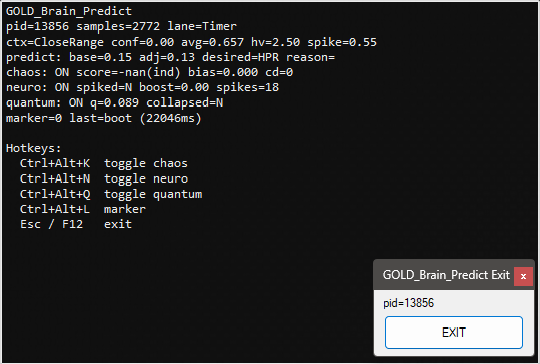

# GOLD_Brain_Predict

Shows a full “brain” pipeline with a HUD observer and hotkey toggles.

## Screenshot

Uses:
- DemonInput, DemonSPSC
- DemonContextDetect
- DemonPredict
- DemonChaos, DemonNeuromorphic, DemonQuantumBuffer
- DemonHUD, DemonHotkeys

## Run
- `stacks/GOLD_Brain_Predict/gold_brain_predict.ahk`

## Hotkeys
- Ctrl+Alt+K — toggle chaos
- Ctrl+Alt+N — toggle neuromorphic
- Ctrl+Alt+Q — toggle quantum buffer
- Ctrl+Alt+L — marker
- Esc / F12 — exit

## Notes
- This stack uses Timer lane for portability.
- Includes an always-on-top EXIT button as a guaranteed shutdown path.
