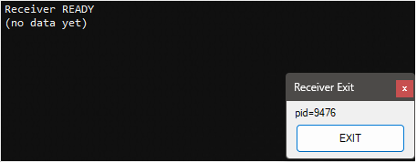

# GOLD_Bridge_ReadyFlag

Demonstrates coordinating two processes using a shared ready flag.

## Screenshots

Uses:
- DemonReadyFlag
- DemonBridge
- DemonHUD

## Run
1) `stacks/GOLD_Bridge_ReadyFlag/gold_receiver.ahk`
2) `stacks/GOLD_Bridge_ReadyFlag/gold_sender.ahk`

Receiver sets ReadyFlag=true. Sender waits (up to 5s) then publishes data to DemonBridge.
Both scripts include an always-on-top EXIT button for guaranteed shutdown.
